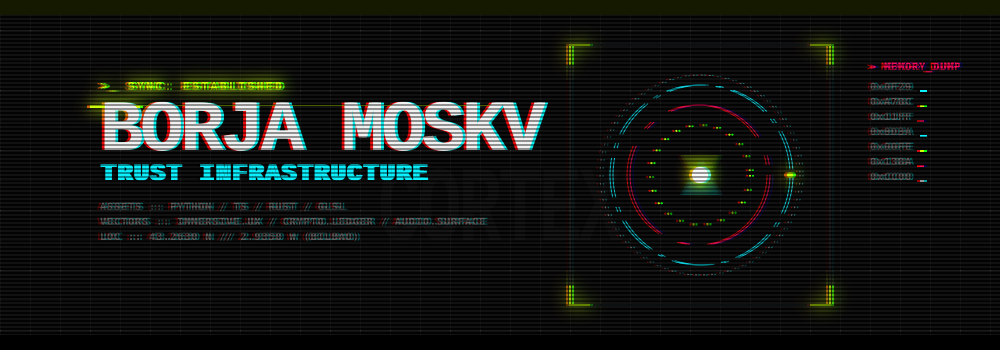
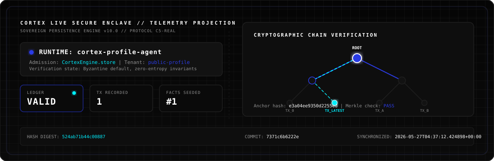

# Borja Moskv

**Sovereign agent infrastructure · trust substrate · formal verification · immersive systems**

I build tools that let autonomous agents remember, verify, execute, and leave evidence.

---

<div align="center">
  
</div>

---

## ▀▄ Focus
- **Persistent memory for agents**: High-density Vector Symbolic Architecture (VSA) memory models.
- **Verifiable AI systems**: Zero-trust containment layers (Epistemic Membrane) using Z3 SMT solvers.
- **Distributed cognition**: Sovereignty middleware (HMAC-SHA256 obfuscation) for multi-agent swarms.
- **Runtime auditability**: Append-Only Ledger (AOF) with SHA-256 Merkle chain verification.

---

## ▀▄ Core Systems

### [CORTEX Persist](https://github.com/borjamoskv/Cortex-Persist)
Tamper-evident memory, audit trails, and verifiable lineage for AI agents. Operating as an **L0 Hypervisor** for autonomous agents.

```mermaid
graph TD
    classDef default fill:#0A0A0A,stroke:#2B3BE5,stroke-width:1px,color:#F0F0F0;
    classDef highlight fill:#2B3BE5,stroke:#CCFF00,stroke-width:1.5px,color:#FFFFFF;
    classDef guard fill:#1A1A1A,stroke:#FF0055,stroke-width:1px,color:#F0F0F0;

    subgraph Stochastic Space
        LLM[Agent Stochastic Output]:::default
    end

    subgraph Epistemic Membrane [CORTEX-Persist Containment Shield]
        direction TB
        G1[Z3 SMT Guard / Admission Gate]:::guard
        VSA[Zero-Copy VSA Ring Buffer]:::default
        mmap[( mmap Silicon Space )]:::default
        Hash[SHA-256 Block Sealing]:::default
        Merkle[Merkle Provenance Chain]:::default
    end

    subgraph Trust Substrate
        Ledger[(Append-Only AOF Ledger)]:::highlight
        Proof[Verifiable Audit Pack JSON]:::default
    end

    LLM -->|Decision / Observation| G1
    G1 -->|Passed Asserts| VSA
    VSA -->|Zero I/O Overhead| mmap
    VSA -->|Batch Commit| Hash
    Hash -->|Hash Link| Merkle
    Merkle -->|State Anchoring| Ledger
    Ledger -->|Generate| Proof
    
    style Epistemic Membrane fill:#050505,stroke:#2B3BE5,stroke-dasharray: 5 5;
    style Trust Substrate fill:#050505,stroke:#CCFF00,stroke-dasharray: 5 5;
```



#### Threat Model & Trust Guarantees
| Threat | Mitigation Mechanism | Guarantee Level |
| :--- | :--- | :--- |
| **Generative Drift (State Drift)** | Z3-solver formal validation constraints on structural input | **Hard Gate (C5-REAL)** |
| **State Tampering (CRUD Bypass)** | SHA-256 hash chaining + local AOF append-only Ledger | **Tamper-Evident Ledger** |
| **I/O Latency Spikes** | Zero-Copy memory mapped `mmap` Vector Symbolic Architecture (VSA) ring buffer | **O(1) Memory Bypass** |
| **Self-Auditing Degradation** | AST Autopoiesis runtime self-mutation to eliminate structural code drift | **Autopoietic Equilibrium** |

#### Quickstart: Run in 3 Minutes
```bash
# Clone and enter the repository
git clone https://github.com/borjamoskv/Cortex-Persist.git
cd Cortex-Persist

# Install in editable mode with development dependencies
pip install -e ".[dev,acceleration]"

# Run the canonical verification and tampering-detection demo
python examples/demo_canonical.py
```

### [agents-archi](https://github.com/borjamoskv/agents-archi)
Sovereign Agentic Architecture Registry — the definitive hub for multi-agent design patterns, including:
- Swarm topologies and inter-agent communication matrices.
- Industrial Noir design tokens for state monitoring UIs.
- Provenance architectures for cryptographic swarm alignment.

### [Anvil](https://github.com/borjamoskv/anvil-lang)
A programming language where trust is a compilation invariant. Formally verified smart contracts via Z3 SMT solver.
- Compile-time contract specification check.
- Automatic verification condition generation and logic proofs.

### [ASL Spec](https://github.com/borjamoskv/asl-spec)
Agent Specification Language (ASL) — open standard for formally specifying and verifying autonomous agent behaviors.

---

## ▀▄ System Infrastructure

### [mac-maestro](https://github.com/borjamoskv/mac-maestro)
Semantic GUI automation bridge for macOS, enabling natural language intent execution via macOS API hooks.

### [cortex-ram-guard](https://github.com/borjamoskv/cortex-ram-guard)
Sovereign daemon for macOS memory monitoring and RSS budgeting to contain execution spikes.

### [homebrew-tap](https://github.com/borjamoskv/homebrew-tap)
Homebrew formulas for local daemon installation: `brew tap borjamoskv/tap`.

---

## ▀▄ Stack & Research Direction
```yaml
Focus:
  - Verifiable Agent Memory & Provenance Layers
  - Formal Verification for Distributed Agent Runtimes
  - Adversarial Testing of Agent Guardrails & Containment Filters
  - Local-first System-level macOS Daemons
Stack:
  Languages: [Rust, Python, TypeScript, Swift, GLSL]
  Verification: [Z3, SMT Solvers, Merkle Tree Chains, SHA-256]
  Substrates: [SQLite Vector, mmap buffers, AOF logs]
  Design: [Industrial Noir 2026, High-Contrast UI, CSS Grid]
```

---

## ▀▄ Engineering Metrics & Security Audits

| Metric | Status / Value | Verification Source |
|---|---|---|
| **CORTEX Persist PRs** | 391+ Merged & Reviewed | Git history |
| **CORTEX Test Suite** | 2,218 / 2,218 passing (100% Green) | `pytest tests/` |
| **Languages in Production** | Python, Rust, TypeScript, Swift | GitHub Linguist |
| **CI/CD Pipeline** | Ruff lint + pytest on every commit | GitHub Actions |

### Verified Security Disclosures (Immunefi & Audits)

| Report ID | Severity | Target Subsystem | Vulnerability Vector | Status |
|---|---|---|---|---|
| `OUROBOROS-EIGEN-03NEW` | **CRITICAL** | EigenLayer AVS | Slashing Desync via Latency Front-run in AVS Orchestration | SUBMITTED |
| `OUROBOROS-LZ-SHADOW-01` | **CRITICAL** | LayerZero V2 | Shadow Library Integrity Bypass in LzV2 during Grace Period | SUBMITTED |
| `OUROBOROS-LIDO-03` | **HIGH** | Lido V3 | Untracked ETH Injection in StakingVault Bypasses Quarantine | SUBMITTED |
| `CORTEX-NET-C5-01` | **INFO** | EVM Topography | Network Topography Sync - Ethereum-Public Latency: 36.80ms | VERIFIED |

---

## ▀▄ Public Surfaces

- Domain: [cortexpersist.com](https://cortexpersist.com) | [agents.archi](https://agents.archi)
- Portrait: [portrait.so/borja](https://portrait.so/borja)
- Audio Foundry: [borjamoskv.bandcamp.com](https://borjamoskv.bandcamp.com)
- Communication: X [@bakaladetroya](https://x.com/bakaladetroya) | Instagram [@borjamoskv](https://www.instagram.com/borjamoskv/)

---

<!-- CORTEX-PROFILE-AGENT:START -->
<div align="center">

### CORTEX Live Agent Surface



[](https://github.com/borjamoskv/Cortex-Persist)   

**Wake -> Guard -> Store -> Hash -> Verify -> Project**

</div>

| Layer | Public Signal |
|---|---|
| Runtime | `cortex-profile-agent` |
| Memory admission | `CortexEngine.store(...) -> fact #1` |
| Ledger | `VALID` over `1` checked transaction(s) |
| Integrity audits | `3` passes |
| Signals processed | `1` events |
| Hash anchor | `6a01d22f5e10efd9e5` |
| Public digest | `fcb0a3d8358cea0e` |
| Profile commit | `36ac50d71567` |
| Generated | `2026-05-27T07:40:31.721192+00:00` |

<details>
<summary>Public evidence packet</summary>

| Field | Value |
|---|---|
| Profile repo | `borjamoskv/borjamoskv` |
| Source repo | `borjamoskv/Cortex-Persist` |
| CORTEX project | `github-profile-agent` |
| Tenant scope | `public-profile` |
| Last public fact | `#1` |
| Merkle roots checked | `0` |
| Public status JSON | `assets/cortex-profile-agent.status.json` |

This is a public projection only. Raw memory, prompts, tenant payloads, secrets, and private ledger details stay outside the README.

</details>
<!-- CORTEX-PROFILE-AGENT:END -->
